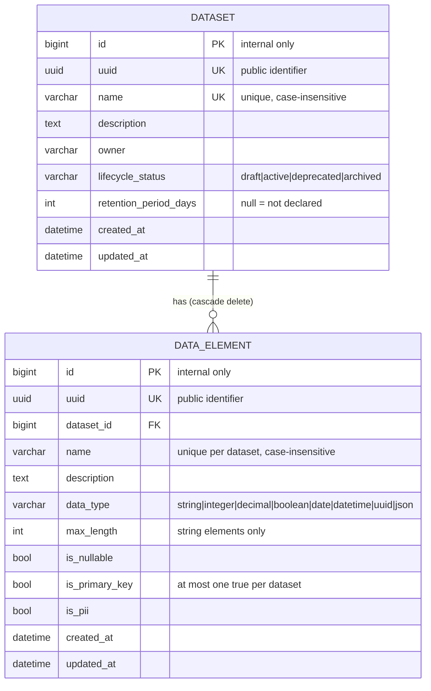

# Data Structure Management Service

A small metadata catalog. It manages **datasets** — business entities such as `Customer`
or `Order` — and the **data elements** that make them up, such as `email` or
`date_of_birth`. It stores metadata *about* data, not the data itself.

Django 5.2 · Django REST Framework 3.18 · SQLite · Python 3.11
236 tests · 100% statement and branch coverage

---

## Contents

- [Quick start](#quick-start)
- [The data model](#the-data-model)
- [Design decisions](#design-decisions)
  - [Why these two models](#why-these-two-models)
  - [Identifiers: integer key, public UUID](#identifiers-integer-key-public-uuid)
  - [How data types are represented](#how-data-types-are-represented)
  - [Where each rule is enforced](#where-each-rule-is-enforced)
  - [Constraints enforced by the database](#constraints-enforced-by-the-database)
  - [Business rules enforced by the service layer](#business-rules-enforced-by-the-service-layer)
- [Architecture](#architecture)
- [API reference](#api-reference)
- [Error contract](#error-contract)
- [Testing](#testing)
- [Assumptions and trade-offs](#assumptions-and-trade-offs)
- [What I would do next](#what-i-would-do-next)

---

## Quick start

### With Docker

```bash
docker compose up --build
```

The service is on <http://localhost:8000>, migrations run at startup. To load an example
catalog:

```bash
docker compose exec api python manage.py seed_catalog
```

Run the tests inside the image:

```bash
docker compose run --rm api pytest
```

### Locally

Requires Python 3.11+. Everything below is also available as `make <target>`; run `make`
on its own for the list.

```bash
python3 -m venv .venv
source .venv/bin/activate
pip install -r requirements-dev.txt

python manage.py migrate
python manage.py seed_catalog     # optional: two example datasets, nine data elements
python manage.py runserver
```

Then:

| What | Where |
| --- | --- |
| API root | <http://localhost:8000/v2/catalog/datasets/> |
| Swagger UI | <http://localhost:8000/v2/docs/> |
| OpenAPI schema | <http://localhost:8000/v2/schema/> |
| Django admin | <http://localhost:8000/admin/> (`manage.py createsuperuser` first) |

### Running the tests

```bash
pytest                                   # 236 tests, ~0.7s
pytest --cov --cov-report=term-missing   # coverage report
ruff check . && ruff format --check .    # lint and formatting
```

`make check` runs exactly what CI runs.

### A five-request tour

```bash
BASE=http://localhost:8000/v2/catalog

# 1. Create a dataset, declaring how long its data may be kept.
curl -X POST "$BASE/datasets/" -H 'Content-Type: application/json' -d '{
  "name": "Customer",
  "description": "A person or organisation that buys from us.",
  "owner": "growth-team",
  "lifecycle_status": "active",
  "retention_period_days": 730
}'

DATASET_UUID=<the dataset_uuid from the response>

# 2. Define its structure in one atomic request.
curl -X POST "$BASE/datasets/$DATASET_UUID/data-elements/actions/bulk-create/" \
  -H 'Content-Type: application/json' -d '{
  "data_elements": [
    {"name": "customer_id", "data_type": "uuid", "is_primary_key": true},
    {"name": "email", "data_type": "string", "max_length": 254, "is_pii": true},
    {"name": "date_of_birth", "data_type": "date", "is_pii": true}
  ]
}'

# 3. Retrieve the dataset with its data elements.
curl "$BASE/datasets/$DATASET_UUID/"

# 4. Find the personal data it holds.
curl "$BASE/datasets/$DATASET_UUID/data-elements/?is_pii=true&ordering=name"

# 5. Find every dataset holding personal data.
curl "$BASE/datasets/?contains_pii=true"
```

---

## The data model



Fields beyond the assignment's minimum, and why each earns its place:

| Field | Why |
| --- | --- |
| `owner` | A catalog nobody owns goes stale. This is the first question asked of any entry. |
| `lifecycle_status` | Distinguishes "being designed" from "in production" from "retired". Also gives retirement an alternative to deletion — see the trade-offs. |
| `retention_period_days` | The *Retention / lifecycle metadata* enhancement, and the anchor of the PII rule below. |
| `is_pii` | The *Marking data elements as PII* enhancement. Turns "where do we hold personal data?" into one query. |
| `max_length`, `is_nullable`, `is_primary_key` | The minimum needed to describe a field's shape rather than just naming it. Each is backed by a constraint. |

---

## Design decisions

### Why these two models

A data element is **part of** a dataset, not a shared thing datasets refer to. `Customer.email`
and `Supplier.email` are different elements that happen to share a name: they can have
different types, different nullability, and one may be personal data where the other is not.

That reading drives three choices that hang together:

- **`on_delete=CASCADE`.** An element has no meaning without its dataset.
- **Uniqueness scoped per dataset**, so both entities may have an `email`.
- **No reassignment.** `dataset` is not an updatable field. Moving a field between entities
  is not an edit — it is a delete and a create, and pretending otherwise hides that.

The rejected alternative was a shared `DataElement` table that datasets link to many-to-many,
which is what you would build for a reusable *glossary* of terms. That is a different product:
it makes every element's type and PII flag global, which is exactly what the modelling above
says they are not. If a glossary is wanted later, it is an additive change — a nullable
`glossary_term` foreign key alongside the existing column, not a rewrite.

### Identifiers: integer key, public UUID

Every table has an auto-incrementing integer primary key **and** a separate indexed `uuid`.
The UUID is the only identifier that ever leaves the service — all URLs and payloads use
`<resource>_uuid`.

Sequential integers as public identifiers leak the size and growth rate of the catalog and
invite enumeration. UUIDs as *primary* keys cost more: they are four times wider in every
index and every foreign key, and their randomness scatters inserts across the B-tree instead
of appending. Splitting the two roles gets both properties, at the price of one extra unique
index. The internal key stays free to change without breaking a single API consumer.

### How data types are represented

`data_type` is a closed enum (`TextChoices`) stored as its string value, with a `CHECK`
constraint pinning the column to the known set.

The alternatives were free text and a `DataType` lookup table. Free text makes the column
unqueryable within a week — `str`, `String`, `varchar` and `character varying` all arrive.
A lookup table would be right if the vocabulary were user-editable, but it is not: it changes
at the pace of a code release, and a join plus an ID indirection buys nothing while making
the values harder to grep, harder to branch on, and harder to read in a response. Widening
the enum is an additive migration; a value is never repurposed.

Types are deliberately **logical**, not physical. `decimal`, not `NUMERIC(12,2)`. A catalog
that describes how data is stored in one particular database stops being true the moment the
same entity is also in a warehouse and an event stream. `max_length` is the one physical
attribute kept, because it is the one that constrains meaning rather than storage — and a
constraint makes sure it is only ever set where it applies.

### Where each rule is enforced

Three layers, and the placement of each rule is deliberate:

| Layer | Enforces | Why there |
| --- | --- | --- |
| **Database** | Properties of a single row | Holds no matter what writes: the API, a migration, the admin, a shell session, a future second service. |
| **Service** | Rules needing other rows or a state transition | Cannot be expressed as a row-level constraint. |
| **Serializer** | Shape and type of the request | Rejects malformed input before any business logic runs. |

The database is the guarantee; the layers above it exist to produce good errors on the way
there. Services call `full_clean()` before saving, which (since Django 4.1) evaluates the
model's `CHECK` and `UNIQUE` constraints in Python and returns a readable, field-mapped
validation error rather than a raw `IntegrityError` naming an index. The constraint is still
what makes the data correct — this only makes the failure legible.

That is why `catalog/tests/test_models.py` writes through `objects.create()` and
`queryset.update()`, which skip validation entirely. Testing constraints through the services
would only prove the Python checks work. Those tests prove the *database* rejects bad data.

### Constraints enforced by the database

| Constraint | Rule |
| --- | --- |
| `dataset_name_unique_ci` | Dataset names are unique, case-insensitively (functional unique index on `LOWER(name)`). |
| `dataset_name_not_blank` | A dataset name cannot be empty. |
| `dataset_lifecycle_status_valid` | `lifecycle_status` is one of the four known values. |
| `dataset_retention_period_positive` | A retention period is either absent or greater than zero. |
| `data_element_name_unique_per_dataset` | Element names are unique within their dataset, case-insensitively. |
| `data_element_single_primary_key_per_dataset` | A dataset has at most one primary key (**partial** unique index, `WHERE is_primary_key`). |
| `data_element_name_not_blank` | An element name cannot be empty. |
| `data_element_data_type_valid` | `data_type` is one of the eight known values. |
| `data_element_max_length_only_for_positive_length_strings` | `max_length` is only allowed on `string` elements, and must be positive. |
| `data_element_primary_key_not_nullable` | A primary key cannot be nullable. |

Two are worth calling out. **Case-insensitive uniqueness** is a functional unique index, not
a Python check: `Customer` and `customer` are the same dataset to every human reading the
catalog, and a check in application code still loses the race between two simultaneous
creates. **One primary key per dataset** is a partial unique index — unique across the rows
where `is_primary_key` is true, unconstrained everywhere else. The entire rule is one index.

`choices` on a model field is validation, not storage: it is enforced by forms and by
`full_clean()`, but nothing stops `Dataset.objects.update(lifecycle_status="banana")`. The
check constraints are what keep those columns trustworthy, and there is a test for each that
proves it by taking exactly that shortcut.

### Business rules enforced by the service layer

These need to look at other rows or at a transition, so no row-level constraint can express
them. They live together in `catalog/services/rules.py` — each is needed by more than one
service, and gathering them makes the service's policy readable in one file instead of having
to be reconstructed from `if` statements scattered through the write paths.

**1. A dataset must declare a retention period before it can hold PII.** → `400`

Storage limitation (GDPR Art. 5(1)(e)) says personal data may not be kept indefinitely. A
metadata catalog is exactly where that becomes answerable, so marking a field as personal
data requires saying for how long. Enforced on both sides, because a rule with one side is
not a rule: you cannot add PII to a dataset with no retention period, **and** you cannot
remove the retention period from a dataset that already holds PII (`409`). Without the second
half it is bypassable in two requests.

**2. Lifecycle transitions follow a state machine.** → `409`

```
draft ──▶ active ⇄ deprecated
  │         │          │
  └─────────┴──────────┴────▶ archived  (terminal)
```

A dataset cannot be created directly as `deprecated` or `archived`. Archiving is deliberately
one-way: a catalog is an audit surface, and quietly resurrecting a retired dataset would make
its history unreliable. Recreating it is an explicit, visible act.

**3. An archived dataset is read-only.** → `409`

No edits to the dataset, and no adding or changing its data elements.

These return `409 Conflict`, not `400`: the request is well-formed and would have been
accepted against a different state of the resource. `400` would tell a client to fix its
payload, which is the wrong advice. Rule 1's *create* case is a `400` because the payload is
what is wrong — PII was claimed for a dataset that cannot hold it.

---

## Architecture

```
config/          Django project: settings, root URLs, JSON error handlers
api/v2/core/     Framework layer, reusable across apps:
                   base.py         BaseView
                   exceptions.py   the one error envelope
                   pagination.py   limit/offset with a hard ceiling
                   serializers.py  inline_serializer
                   openapi.py      schema helpers derived from filters and ordering
                   filters/        filter primitives + apply_filters
common/          Domain-level shared code, no HTTP dependency:
                   exceptions.py            ApplicationError and friends
                   models/base.py           BaseModel (uuid + timestamps)
                   models/services.py       model_update
                   models/queryset_ordering.py  declarative ordering
catalog/         The app
                   models.py       Dataset, DataElement, constraints, managers
                   selectors/      read side: scoping, filtering, ordering
                   services/       write side: everything that changes data
                   services/rules.py  the business rules, in one place
                   filters/        FilterSets
                   api/            serializers, views, urls
                   tests/          mirrors the structure above
```

**Views are plain `APIView`s.** No `ModelViewSet`, no generic views. Every handler reads as
three steps — validate the input, call a selector or a service, serialize the result — so
what a route does is visible in the route rather than assembled from mixins and hooks
several classes away. What is borrowed from DRF's generic views is pagination, since
reimplementing `?limit=&offset=` per view would be pure duplication.

**Serializers are plain `Serializer`s, not `ModelSerializer`s.** A `ModelSerializer` derives
the API contract from the model, so adding a column silently changes what the API returns.
Spelling the fields out makes the contract a decision, and makes it visible in review when
it changes.

**The dependency direction is one-way: `api → catalog → common`.** Domain exceptions live in
`common` and know nothing about HTTP; `api/v2/core/exceptions.py` is the only place that
decides which status code each maps to. That is what lets a service be called from a
management command — `seed_catalog` does exactly this — without dragging DRF along.

**Selectors decide which rows; serialize functions decide which joins.** Selectors return
unevaluated querysets so views can paginate them and services can compose them. They do not
`select_related`, because a prefetch baked into a selector is paid for by every caller
including the ones that only wanted a count. The joins live next to the serializer whose
fields need them (`data_elements_for_serialization`, `serialize_dataset_detail`). Annotations
that are part of the resource contract — `data_element_count` — live on the model manager
as a reusable queryset method, since they must be applied before pagination slices the
queryset into a list.

Three tests assert query counts (`django_assert_num_queries`) so none of this can silently
regress into an N+1.

---

## API reference

Every URL follows the style guide: kebab-case segments, plural resource names, nested
resources under their parent, non-CRUD operations under `actions/`.

| Method | Path | Purpose |
| --- | --- | --- |
| `GET` | `/v2/catalog/datasets/` | List datasets — paginated, filterable, sortable |
| `POST` | `/v2/catalog/datasets/` | Create a dataset |
| `GET` | `/v2/catalog/datasets/{dataset_uuid}/` | Retrieve a dataset **with its data elements** |
| `PATCH` | `/v2/catalog/datasets/{dataset_uuid}/` | Update a dataset |
| `GET` | `/v2/catalog/datasets/{dataset_uuid}/data-elements/` | List a dataset's data elements |
| `POST` | `/v2/catalog/datasets/{dataset_uuid}/data-elements/` | Add a data element |
| `POST` | `/v2/catalog/datasets/{dataset_uuid}/data-elements/actions/bulk-create/` | Add up to 100, atomically |
| `GET` | `/v2/catalog/datasets/{dataset_uuid}/data-elements/{data_element_uuid}/` | Retrieve a data element |
| `PATCH` | `/v2/catalog/datasets/{dataset_uuid}/data-elements/{data_element_uuid}/` | Update a data element |

**Filtering.** Datasets: `name` (substring), `owner`, `lifecycle_status`,
`lifecycle_status__in`, `has_retention_period`, `contains_pii`, `created_at_after`,
`created_at_before`, `search`. Data elements: `name`, `data_type`, `data_type__in`, `is_pii`,
`is_nullable`, `is_primary_key`, `search`.

**Ordering.** `?ordering=name`, `?ordering=-created_at`. Repeat the parameter to sort by
several keys in priority order: `?ordering=-is_pii&ordering=name`. An unknown field is a
`400` listing the allowed ones, not a silently ignored parameter — a client that misspells a
field should be told, not handed a differently-sorted page that looks plausible.

**Pagination.** `?limit=&offset=`, default 25, capped at 100. A primary-key tiebreaker is
always appended to the sort, because paging over a non-unique key such as `name` otherwise
lets the database break ties differently between pages, silently repeating and skipping rows.

**Nesting.** The dataset detail endpoint is the one nested response, at the style guide's
one-level cap. It earns it: "show me this entity's structure" is the question that endpoint
exists to answer, and splitting it would make every consumer write the same two-request
dance. Everywhere else is flat — list responses carry `data_element_count` instead of the
elements themselves. The nested elements are a summary: inside its parent, an element's
`dataset_uuid` is noise and its audit timestamps are not what the reader came for.

Full request and response schemas, including every filter, are at `/v2/docs/`. The filter and
ordering parameters in that document are derived from the same `FilterSet` and
`OrderingService` objects the runtime uses, so they cannot drift.

---

## Error contract

Every failure returns the same envelope, so clients branch on `code` and render `detail`:

```json
{
  "code": "conflict",
  "detail": "Dataset 'Customer' is archived and can no longer be modified.",
  "extra": {"dataset_uuid": "…", "lifecycle_status": "archived"}
}
```

| Status | When |
| --- | --- |
| `400` | Malformed input, a violated constraint, or a rule about the payload itself |
| `404` | The resource does not exist — including a real element addressed under the wrong dataset |
| `405` | Method not offered on this resource |
| `409` | The request conflicts with the resource's current state (lifecycle, archived, PII retention) |
| `500` | A bug. Never a dressed-up `400` |

`extra` carries machine-readable context: which fields failed, which lifecycle transitions
were allowed, which element of a batch was rejected (`index`), which PII elements block a
retention change.

Two details worth noting. An element addressed under the wrong dataset is a `404`, not a
`403` — that URL names nothing, and answering differently would confirm the existence of
another dataset's fields. And routing-level failures, such as a malformed UUID rejected by
the URL converter, never reach DRF; `config/api_errors.py` keeps those in the same envelope
instead of returning Django's HTML error page.

---

## Testing

```
236 tests, 100% statement and branch coverage, ~0.7s
```

| Suite | What it pins |
| --- | --- |
| `catalog/tests/test_models.py` | Every database constraint, written through `objects.create()` / `queryset.update()` so validation is bypassed |
| `catalog/tests/test_services/` | Every business rule, including the bypass attempts each rule has to survive |
| `catalog/tests/test_selectors/` | Scoping, every filter, ordering, and rejection of unknown fields |
| `catalog/tests/test_views/` | The full HTTP contract: status codes, envelope, payload shape, query counts |
| `common/tests/` | `model_update` and the ordering service |
| `api/v2/core/tests/` | The error envelope, `inline_serializer`, `BaseView`, the generated schema |

The assignment asks for at least one endpoint test and one business-rule test. The suite
covers every endpoint and every rule, because the interesting part of this design is the
rules, and a rule with no test is a comment.

A few tests exist for reasons that are not obvious from their names:

- **`test_the_pii_filter_does_not_duplicate_rows`** — the `contains_pii` filter uses a
  correlated `EXISTS`. A join-based implementation returns a dataset once per matching
  element, which then corrupts the pagination count.
- **`test_a_tiebreaker_makes_the_order_deterministic`** — pins the guarantee that keeps
  limit/offset pagination from repeating and skipping rows.
- **`test_the_nested_elements_cost_one_extra_query`** and its siblings — three query-count
  assertions that fail the moment someone reintroduces an N+1.
- **`test_the_runtime_envelope_matches_the_documented_one`** — the pagination envelope is
  written in two places (the paginator, the OpenAPI helper). This is the only test that would
  catch them drifting, which would silently make every generated client wrong.
- **`test_validation_costs_queries`** — documents that `full_clean()` costs five queries per
  write here, so the trade-off stays visible instead of becoming folklore.
- **`catalog/tests/test_management.py`** — the seed command goes through the services, so if
  a rule changes and the example data no longer complies, this fails rather than inserting
  data the API itself would reject.

CI (`.github/workflows/ci.yml`) runs lint, formatting, a missing-migration check,
`manage.py check --deploy`, schema generation, the suite with a coverage floor, and a Docker
build that runs the suite inside the image.

---

## Assumptions and trade-offs

**No authentication or authorisation.** Every endpoint is open. The assignment does not ask
for it and inventing a permission model would have been the largest speculative piece of the
submission. The seam is there: `BaseView` is where `permission_classes` goes, and no view
looks at `request.user`. What would need real thought is not authentication but
authorisation — a catalog usually wants "anyone may read, the owning team may write", which
means `owner` becomes a foreign key to a team rather than free text.

**No multi-tenancy.** The style guide's examples are full of `tenant`, and a real deployment
would scope every selector by it. Adding it later means a `tenant` foreign key, a `tenant`
argument on the selectors, and folding it into the two uniqueness constraints — which is
routine precisely because all reads already go through selectors. Building it now, with no
tenant model to attach it to, would have been guessing.

**No delete.** Retirement is `lifecycle_status: archived`, and archived is terminal and
read-only. For a catalog, "what did this entity look like when that report was written" is a
question people actually ask, and a hard delete makes it unanswerable. A GDPR erasure request
is about the *data*, not about the metadata describing its shape, so this does not conflict
with the retention rule. If a real delete is needed, it belongs as an explicit
`actions/purge/` with a different permission, not as `DELETE` on the resource.

**PATCH but no PUT.** A full replace silently blanks every field the client omitted, which
is a data-loss bug waiting for the first client that builds its payload from a partial form.

**`full_clean()` on every write costs five queries.** Two uniqueness probes and three check
constraint evaluations, on top of the write. That is a deliberate trade for field-mapped,
human-readable errors on every write path, and it is worth it for a catalog written by
humans at human speed. It would not be worth it in a hot ingest loop — that path would skip
`full_clean()` and handle `IntegrityError` instead. `test_validation_costs_queries` keeps the
cost visible.

**Bulk create inserts one row at a time.** `bulk_create` would be faster but skips
`full_clean()`, so a batch of twenty would fail with a database error naming an index
instead of a validation error naming a field — and "which one was wrong" is the only thing
the caller needs to know. At a ceiling of 100 rows, inside one transaction, correctness wins.

**Ordering is not on the model's `Meta`.** Per the style guide's note, default ordering lives
in the `OrderingService` for each endpoint. A model-level default silently applies to every
query in the codebase, including aggregates where it does nothing but add a sort.

**SQLite.** As the assignment allows. Everything used here — functional unique indexes,
partial unique indexes, check constraints, `NULLS LAST` — works identically on PostgreSQL,
which is what a real deployment would use. The only change is the `DATABASES` block. The one
thing that would want revisiting is `search`, which is `ILIKE`-style substring matching;
on PostgreSQL that becomes a trigram index or full-text search once the catalog is large.

**Timezone is `Europe/Amsterdam`, amounts in the seed data are in euro.** `USE_TZ` is on and
timestamps are stored in UTC and rendered with an offset.

---

## What I would do next

In the order I would actually do them:

1. **Authentication and per-team authorisation.** `owner` becomes a foreign key to a team;
   read is open, write is restricted to the owning team.
2. **A catalog-wide PII endpoint.** `GET /v2/catalog/data-elements/?is_pii=true` across all
   datasets is the report a data protection officer actually wants; today that requires one
   request per dataset. It is deliberately not in this submission because the assignment
   scopes element listing to a dataset, and the filtering to support it already exists.
3. **An audit trail.** Who changed a data element's type, and when. A catalog that cannot
   answer that is trusted less than it should be.
4. **Versioning of a dataset's structure.** "What did `Customer` look like in March?" —
   needed to interpret historical data, and the natural next step after the audit trail.
5. **Multi-tenancy**, as described above.
6. **PostgreSQL plus a real search index**, once the catalog outgrows substring matching.

Two things I would change about what is already here, given more time:

- **`update_dataset` and `update_data_element` re-read the dataset for rule checks.** With
  concurrent writers, the archived check and the write should hold a row lock
  (`select_for_update`) to close the window between them. Single-writer SQLite hides this;
  PostgreSQL would not.
- **The dataset detail endpoint does not paginate its nested elements.** Fine for the tens of
  fields a business entity actually has, wrong for a wide analytics table with hundreds. I
  would cap the nested list and point at the paginated endpoint past that point.

---

## Time spent

Roughly five hours, against the assignment's 3–5 hour guidance. The bulk of it went to the
constraint and rule design and to the tests that pin them; the layering follows the provided
style guide, and the enhancements (PII, retention/lifecycle, filtering, OpenAPI, Docker) were
each small once that structure was in place.
